# LLM Router Agent

An intelligent proxy that sits between a company's internal tools and LLM APIs.
Classifies prompt complexity, routes to the cheapest capable model, enforces
per-session token budgets, and gives the agent persistent memory.

**100% free. No OpenAI key. No credit card.**

---

## Project Structure

```
llm-router-agent/
├── core/
│   ├── classifier.py       ← 4-signal complexity scorer (ML-based)
│   ├── router.py           ← model selector + override rules
│   ├── budget_guard.py     ← token spend cap + loop kill switch + audit log
│   └── memory.py           ← ChromaDB persistent vector memory
├── tools/
│   ├── web_search.py       ← DuckDuckGo search (no API key)
│   ├── code_executor.py    ← subprocess Python executor with timeout
│   └── file_reader.py      ← PDF + CSV reader
├── api/
│   └── main.py             ← FastAPI entrypoint, all routes
├── hf_connector.py         ← HuggingFace async model connector
├── config.py               ← all thresholds, model names, limits
├── requirements.txt
├── index.html
├── .env.example
└── tests/
    ├── test_classifier.py
    └── test_budget_guard.py
```

---

## Quickstart

```bash
# 1. Install
pip install -r requirements.txt

# 2. Set your free HuggingFace token
#    Get one at: https://huggingface.co/settings/tokens
cp .env.example .env
# edit .env → paste HUGGINGFACE_API_TOKEN=hf_xxx

# 3. Run
uvicorn api.main:app --reload --env-file .env

# 4. Test
pytest tests/ -v
```

---

## Architecture

```
Incoming Request
      │
      ▼
 FastAPI (api/main.py)
      │
      ├─ 1. ComplexityClassifier  (core/classifier.py)
      │      4 signals → score 0.0–1.0
      │
      ├─ 2. Router  (core/router.py)
      │      score + override rules → ModelTier + ModelConfig
      │
      ├─ 3. AgentMemory  (core/memory.py)
      │      ChromaDB retrieval → inject past context
      │
      ├─ 4. BudgetGuard  (core/budget_guard.py)
      │      open session → 3 tripwires → kill or continue
      │
      ├─ 5. HFConnector  (hf_connector.py)
      │      async call → Mistral-7B or Mixtral-8x7B
      │
      └─ 6. Memory.store + Response
```

---


## API Routes

### `POST /complete`
```bash
curl -X POST http://localhost:8000/complete \
  -H "Content-Type: application/json" \
  -d '{"prompt": "Analyze the tradeoffs between REST and gRPC."}'
```

**Response includes:** `text`, `tier_used`, `model_id`, `tokens`, `latency_ms`,
`complexity_score`, `classifier_signals`, `memory_ctx_used`, `fallback_used`

### `GET /health`
Liveness check + memory entry count.

### `GET /spend`
Last 50 sessions with token cost, status, and kill reason.

---

## Configuration

Everything lives in `config.py` — no scattered magic numbers:


| Setting | Default | What it controls |
|---|---|---|
| `SIMPLE_MODEL.model_id` | Mistral-7B-Instruct | Fast model |
| `COMPLEX_MODEL.model_id` | mistralai/Mixtral-8x7B-Instruct-v0.3 | Heavy model |
| `CLASSIFIER.complexity_threshold` | 0.40 | Score cutoff for COMPLEX |
| `BUDGET.max_tokens_per_session` | 8,000 | Hard token budget |
| `BUDGET.max_iterations` | 12 | Loop iteration cap |
| `BUDGET.repetition_threshold` | 0.85 | Stuck-agent ratio |
| `MEMORY.max_results` | 5 | Past context injected per request |

---

## Budget Guard Tripwires

| Tripwire | Default | Catches |
|---|---|---|
| Token spend | 8,000 tokens/session | Runaway long-form generation |
| Iteration cap | 12 LLM calls | Infinite planning loops |
| Repetition lock | ratio ≥ 0.85 | Stuck agent echoing itself |

Kill events → `budget_audit.db` with full replay via `GET /spend`.

---

## Models (all free)

| Tier | Model | Use case |
|---|---|---|
| SIMPLE | `mistralai/Mistral-7B-Instruct-v0.3` | Format, translate, QA |
| COMPLEX | `mistralai/Mixtral-8x7B-Instruct-v0.1` | Reasoning, code, analysis |
| Embed | `all-MiniLM-L6-v2` | Complexity classification |

---

## HTTP Error Codes

| Code | Meaning |
|---|---|
| 402 | Token budget exceeded |
| 429 | Agent loop killed |
| 502 | HuggingFace model error |
| 500 | Unexpected internal error |
